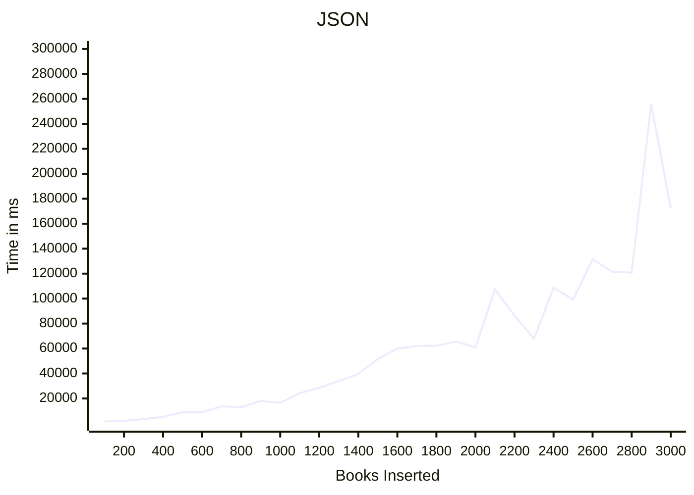
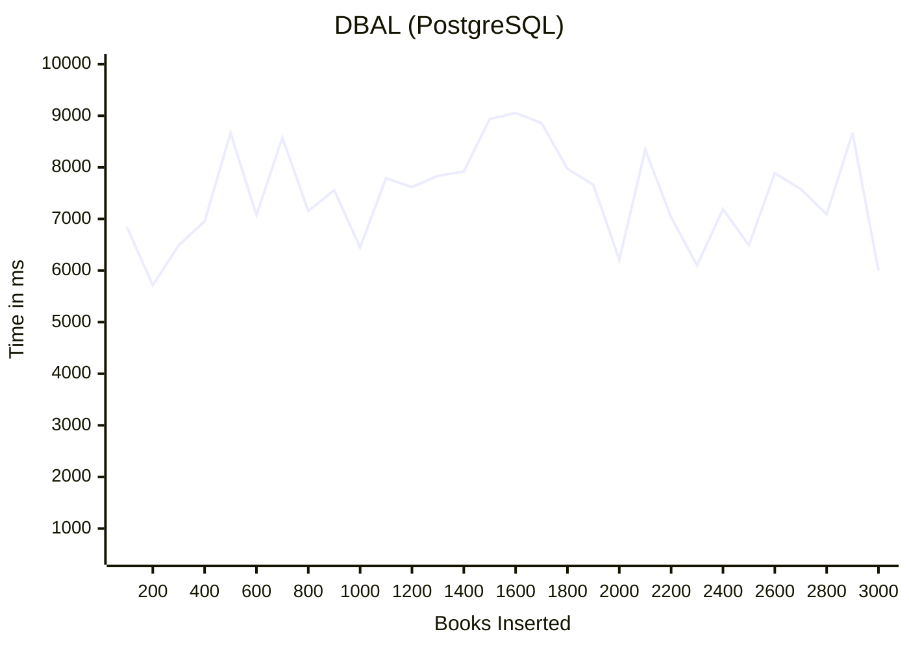
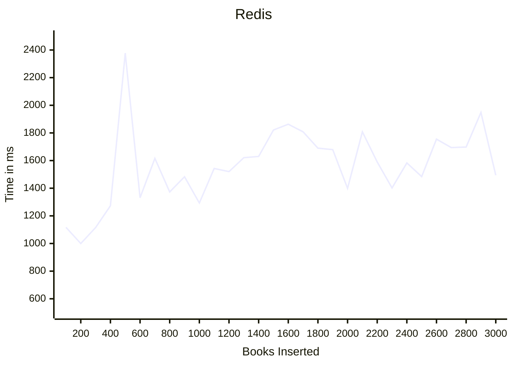
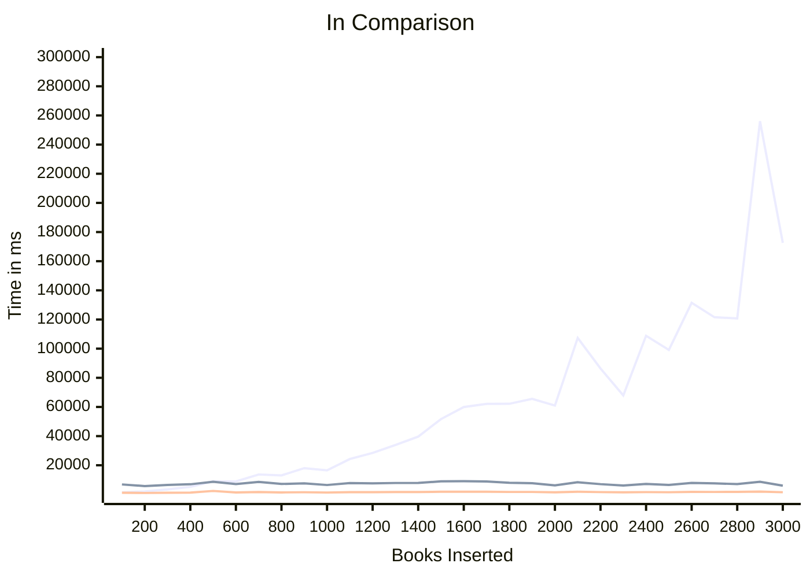

# PHPhinder Bundle 


[](LICENSE)  
[](https://packagist.org/packages/eliasfernandez/phphinder-bundle)  

---


## What is it?  
[PHPhinder](https://github.com/eliasfernandez/phphinder) is an open-source, lightweight, and modular search engine designed for PHP applications. It provides powerful search capabilities with a focus on simplicity, speed, and extensibility.

The PHPhinder bundle connects PHPhinder with Symfony to improve the searchability of Doctrine entities. 

---

## Installation  
Install PHPhinder via Composer:  
```bash
composer require eliasfernandez/phphinder-bundle
```

---

## Usage

### Entities

Imagine a book entity we want to optimize to search for. This is how it could look like:

```php
class Book
{
    #[ORM\Id]
    #[ORM\GeneratedValue]
    #[ORM\Column]
    #[PHPhinder\Property(Schema::IS_UNIQUE | Schema::IS_INDEXED | Schema::IS_REQUIRED| Schema::IS_STORED)]
    private ?int $id = null;

    #[ORM\Column(length: 255)]
    #[PHPhinder\Property(Schema::IS_INDEXED | Schema::IS_STORED | Schema::IS_REQUIRED | Schema::IS_FULLTEXT)]
    private ?string $title = null;

    #[ORM\Column(type: Types::SIMPLE_ARRAY)]
    private array $authors = [];

    #[ORM\Column(type: Types::TEXT)]
    #[PHPhinder\Property(Schema::IS_INDEXED)]
    private ?string $description = null;
...
    
    #[PHPhinder\Property(Schema::IS_INDEXED | Schema::IS_REQUIRED, name: 'authors')]
    public function getAuthorsCsv(): string
    {
        return implode(', ', $this->authors);
    }}
```

### Controller

On the controller side we'll need to configure the Search engine to look for `Book` objects:

```php
    private SearchEngine $searchEngine;

    public function __construct(private StorageFactory $storageFactory, private SchemaGenerator $schemaGenerator)
    {
        $this->searchEngine = new SearchEngine(
            $this->storageFactory->createStorage(
                $this->schemaGenerator->generate(Book::class)
            )
        );
    }

```

Then, in the actions, we can get results with one single method:

```php
    #[Route('/search', name: 'app_search', methods: ['GET', 'POST'])]
    public function index(Request $request): Response
    {
        $query = $request->query->get('q', '');
        $results = [];

        if ($query) {
            $results = $this->searchEngine->search($query);
        }

        return $this->render('search/index.html.twig', [
            'query' => $query,
            'results' => $results,
        ]);
    }
```

### Configuration

#### `phphinder.storage` and `phphinder.name`

You can define where the indexes are going to exist by configuring these two variables:

* phphinder.storage could be `dbal`(search entities will live in a database), `redis` (entities stored in a redis engine) or `json` (in this case the data is stored in files).
* phphinder.name depending on the chosen storage the name will be considered as a folder inside the `var` folder on the project (in case the storage is json) or as database defined by a DBAL dsn connection string. 

#### `phphinder.auto_sync`

If `auto_sync` is enabled. Every time a searchable entity is added or updated the search engine will store the neccesary indexes.
Attention: It could have a very high impact in systems with a high volume of writing in the database.

### `phphinder.sync_in_background`

When `sync_in_background` is enabled, a message is sent to the queue, and the message handler triggers an event to index the entity in the search engine. This process is nearly immediate, enabling the loading of 100,000 records in approximately 2 minutes. The actual message consumption process takes longer but does not impact entity generation. This can be done in parallel by as many consumers as needed.

---

### Performance

As with any search engine, index creation is significantly slower than generating entities in the database. Indexing involves splitting documents into tokens, transforming these tokens into relevant search strings, aggregating a fuzzy search state index, and (the most time-consuming part) persisting these calculations to storage.

By default, this bundle triggers the indexing mechanism on entity persistence. While convenient, this approach can noticeably affect overall application performance. To mitigate this, indexing logic can be moved to queue processing using the `sync_in_background` parameter.

Performance also varies based on the storage backend. Let’s evaluate some configurations. Using the [phphinder-project](https://github.com/eliasfernandez/phphinder-project), we measure the time required to create the first 3,000 books and then test search performance for the common keyword `human`. These metrics provide insights into indexing and search speed.

---

### Hardware Specifications

- **Processor:** AMD Ryzen 7 5700G with Radeon Graphics (16 cores)
- **Memory:** 32GB RAM

---

### `auto_sync` with JSON Storage

#### Indexing Speed



**Conclusion:** Very slow.

It is fast for the first entities but starts to degrade with linear growth. The larger the files, the longer it takes to write to them.

---

#### Search Speed

**Conclusion:** Very fast.

It takes only 106ms to load `human` search results.

---

### `auto_sync` with DBAL (PostgreSQL)

#### Indexing Speed



**Conclusion:** Slow but does not degrade.

It takes an average of 7.5 seconds to process 100 entities and maintains this performance regardless of the number of entities.

---

#### Search Speed

**Conclusion:** Very fast.

It takes 106ms to load `human` search results, similar to JSON storage.

---

### `auto_sync` with Redis Storage

#### Indexing Speed



**Conclusion:** Fastest option.

It averages 1.5 seconds to process 100 entities and maintains this speed regardless of the total number of entities.

---

#### Search Speed

**Conclusion:** Slow.

It takes 700ms to load `human` search results. This could be related to the implementation of the Redis storage or limitations with Redis itself. Performance remains consistent even with 100,000 books.

---

### Final Notes



Looking at the results, JSON is not recommended as a storage option except in specific cases:

- Fewer than 5,000 documents need indexing.
- The application is static and infrequently updated.
- Database usage is restricted or costly.

For write-intensive applications where search speed is less critical, Redis is the best choice. However, for most use cases, DBAL provides a good balance of indexing speed, search performance, and reliability. With `sync_in_background`, DBAL is fast enough for indexing, very fast for searches, and highly reliable.

Try it out with the [PHPhinder project](https://github.com/eliasfernandez/phphinder-project)!
